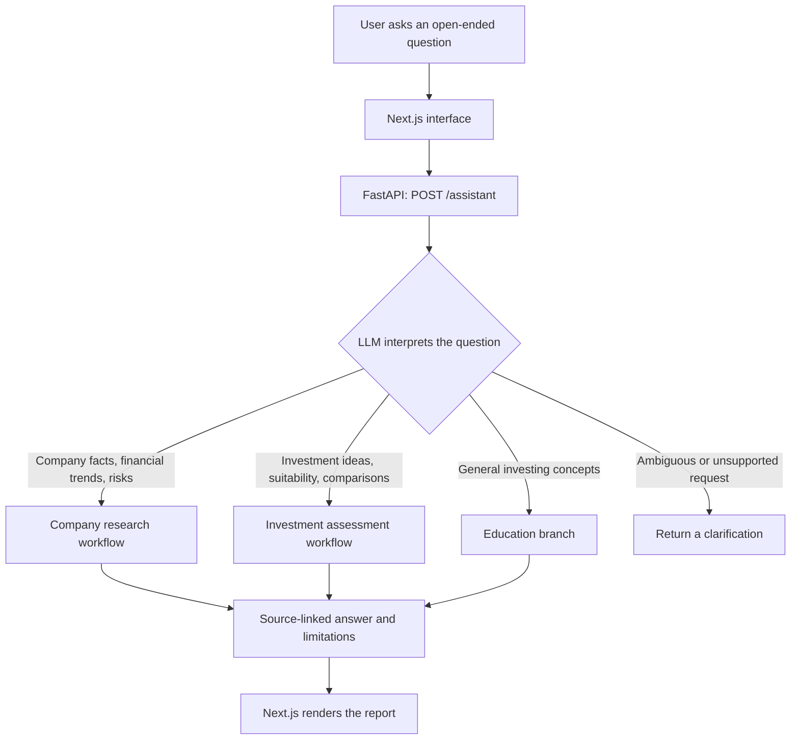

# Financial Research Agent

**Ask an investing question. Follow the evidence. Understand the answer.**

An AI research application that investigates public companies through SEC filings,
financial data, and deterministic Python calculations. It combines an iterative
LangGraph workflow with a FastAPI backend and a Next.js interface, presenting
source-linked findings in language a beginner can understand.

**Python · FastAPI · LangGraph · Next.js · TypeScript · OpenRouter / Ollama**

[Quick start](#quick-start) · [Architecture](#architecture) · [Tools](#tools-and-data) · [Evaluation](#testing-and-evaluation) · [Limitations](#current-limitations)

## One assistant, one question box

Open `/` and ask a company, investment, comparison, or education question. An LLM
routing step chooses the existing workflow without requiring a question-type
selector. Each workflow retains its tools, verification checks and report format.

| Your question | Internal workflow | Answer |
| --- | --- | --- |
| “Why have Microsoft's operating margins changed?” | Company research | Financial explanation with checked calculations and sources |
| “What might I be overlooking about Apple?” | Company research | Evidence-backed business risks and unanswered questions |
| “What stocks could I research for long-term investing?” | Investment assessment | Conditional company assessments and limitations |
| “Compare Microsoft and NVIDIA as investments.” | Investment assessment | Comparative evidence, risks and optional sentiment research |
| “What is diversification?” | Investing education | A source-backed explanation without a stock shortlist |

The question is passed intact to the selected workflow. Mixed investment and
financial questions use the investment workflow's research tools. Ambiguous or
unsupported requests can return a clarification. The sentiment agent is available automatically; the investment lead decides
whether to consult it based on the question. Include
personal preferences directly in your question; the assistant does not invent them.

The legacy `/stock-ideas` page redirects to `/`. Existing `/research` and
`/stock-ideas` API endpoints remain available, while the shared interface uses
`POST /assistant`. Live unified runs share a 36-model-request cap including the
routing call and hosted retries. Offline demonstration bypasses the LLM router
and uses explicitly fictional research fixtures.

Company research answers are explanatory, not buy/sell recommendations. Investment
assessments remain conditional educational judgments; the assistant cannot place
trades or establish personal suitability.

## Architecture

**One interface routes each question to an appropriate workflow.** The company
research and investment workflows share tool infrastructure but retain separate
LangGraph graphs. Investing education is a shorter branch inside the investment
graph. The sentiment agent is a specialist the investment lead can consult when
useful; it does not run for every question.

### From the question to the right workflow



FastAPI streams progress events while the selected workflow runs, then sends the
final report. The original question reaches the workflow intact. Users do not
select a workflow or manually enable the sentiment agent.

### How the investment lead investigates

The graph first resolves companies, plans the research, and collects baseline
financial, filing and market evidence. The **additional investigation loop** is
agent-directed: the lead examines what it knows and chooses its next action.

A tool retrieves data or performs an operation. The sentiment agent has its own
bounded search, reading and review loop, then returns a compact brief to the lead.
The lead can use that brief to choose another financial tool. Sentiment is opinion
context; investment claims still need financial or filing evidence.

The loop is bounded by time, model requests and investigation decisions. Reaching
a limit does **not** mean the evidence is sufficient: unresolved gaps remain in
the report, and unsupported claims are withheld.

### How the other paths differ

| Path | Main steps | Verification and result |
| --- | --- | --- |
| **Company research** | Plan → choose tool → execute → assess evidence → repeat as needed | Verify claims; return to investigation or assessment when needed and budget permits; synthesize and validate an explanatory report. |
| **Investing education** | Identify topic → retrieve investing guides → draft a plain-language explanation | Check citation IDs and numbers, then review against sources. Unsupported explanations are withheld. No company shortlist or sentiment consultation. |

For example, “Why have Microsoft's operating margins changed?” takes the company
research path. “Compare Microsoft and NVIDIA as long-term investments” takes the
investment path, where the lead may consult sentiment if current commentary helps
answer the question. “What is diversification?” takes the education branch.

### Responsibilities and code map

| Component | Responsibility | Implementation |
| --- | --- | --- |
| **Next.js interface** | Submit a question, display progress, render the appropriate report | [Frontend](frontend/app/page.tsx) |
| **FastAPI and router** | Validate requests, stream events, choose a workflow, share the model-call budget | [API](backend/app/api.py) · [Router](backend/app/assistant.py) |
| **Company research graph** | Plan, investigate, assess, verify and synthesize | [Research graph](backend/app/agent/graph.py) |
| **Investment and education graph** | Collect evidence, select further tools, consult sentiment when useful, review the answer | [Investment graph](backend/app/ideas/graph.py) |
| **Sentiment agent** | Find and read recent public articles; return attributed, reviewed arguments | [Sentiment agent](backend/app/ideas/sentiment.py) |
| **Tools and Python checks** | Retrieve evidence, calculate metrics and preserve source lineage | [Tool registry](backend/app/tools/registry.py) · [Investment tools](backend/app/ideas/tools.py) |
| **LLM adapters** | Structured planning, tool selection, interpretation and source review | [Ollama](backend/app/providers/llm.py) · [OpenRouter](backend/app/providers/openrouter.py) |

Python executes financial calculations using observed evidence IDs rather than
numbers invented by the LLM. It also validates structured responses and citation
references. Model-based source review is an additional check, not a guarantee of
accuracy. Retrieved content is treated as untrusted input.

Each run keeps the question, companies, plan, observations, sources, tool calls,
findings, checks and iteration counts **in memory for that run only**. There is no
database or saved research history. Docker Compose runs the frontend and backend;
Ollama runs on the host, or the backend calls OpenRouter. No RAG, vector database,
Redis, Celery, authentication or general-purpose delegation framework is required.

### Optional sentiment consultation

The lead uses financial APIs and Python tools directly. It can call its
`consult_sentiment` agent for a selected
company when market expectations or competing investment arguments matter.
There is no general delegation planner, dynamic worker creation, or separate
research/analysis agent. The old `workflow` request field has been replaced by
`sentiment_enabled` (default true) for API-level evaluations. The website does
not require users to enable sentiment research.

The sentiment worker discovers articles through **Yahoo Finance RSS, Bing News,
Bing web RSS, and DuckDuckGo web search**. These free endpoints are best-effort;
an unavailable provider does not discard results from other providers. Searches
stay scoped to the resolved company, with an optional focused follow-up query.
There is no fixed publisher allowlist: discovered HTTPS articles may come from
any public host that passes destination checks. Private addresses, credentials,
unsafe redirects, oversized responses and unsupported content types are rejected.
Connections are pinned to validated public addresses and retain TLS verification.

The worker chooses which articles to read and whether further searching is useful.
It filters obviously irrelevant search results, requires a usable publication date
within the last 30 days, extracts accessible body text, preserves original provider
attribution when available, and removes near-identical syndicated copies. It does
not bypass paywalls, log in, or treat search snippets as article evidence.

Each consultation allows up to two multi-index searches, 36 candidates per search,
ten article-read attempts, and five investigation decisions within a bounded time
and shared model-call budget. Results may be smaller because of access failures,
missing dates, repetition, or insufficient useful evidence. The lead can consult
at most twice per run. All model calls, including extraction and review, share the
36-request default budget. With Ollama these are local calls; no extra key is needed.

### What the sentiment brief contains

- **Overall sentiment in the retrieved sample**, with insufficient-evidence status
  when there is not enough varied opinion coverage; never market-wide consensus.
- The strongest **bullish and bearish arguments**, material reported developments,
  disagreements, and specific questions to check with financial or filing tools.
- Explicit separation of **reported facts, management claims, analyst opinions,
  author opinions, forecasts and speculation**. Reported facts are not independently
  verified merely because an article states them.
- Exact supporting excerpts, source links, publication dates and available author
  attribution. Metadata does not independently establish expert credentials.
- Coverage counts, unsuccessful reads, duplicate exclusions and uncertainty.

Python checks quote existence and citation IDs. Model review checks relevance,
classification, attribution and synthesis against source context. Bare reported
facts do not count as sentiment votes. If a free-form synthesis fails review, only
individually reviewed points can form a conservative fallback brief. Unknown or
unreviewed material is withheld. The lead receives this compact brief, not raw
pages or retrieval logs, and can use its verification tasks to investigate further.
Recommendation claims still require the lead's financial/filing evidence.

A live local-Ollama development smoke run retrieved several publishers and produced
a sourced mixed-sentiment assessment. This demonstrates integration, not investment
accuracy, representative coverage, or an advantage over the lead alone. See the
[evaluation guide](backend/app/evaluation/README.md) for repeatable live checks
and the [validation record](backend/app/evaluation/SENTIMENT_VALIDATION.md) for
measured coverage and known limits.

## Quick start

### Run with Docker Compose

Install and start Docker Desktop (or Docker Engine with Compose on Linux).
Copy `.env.example` to `.env` if you do not already have one, then set
`SEC_USER_AGENT` and your model configuration as described below. Compose reads
that file automatically and passes credentials only to the backend at runtime.
The build contexts exclude environment files, keys and local dependencies.

```sh
docker compose up --build -d
docker compose ps
```

Open http://127.0.0.1:3000. Stop any existing local frontend/backend first,
since Compose uses the same ports (3000 and 8000). Both published ports bind
only to your computer's loopback interface. This is a local setup, not a public
hosting configuration. No database, saved research volume, or model download
is included in the images.

For **local Ollama**, keep Ollama running on your host and download the model
named in `OLLAMA_MODEL`. Compose connects through `host.docker.internal:11434`;
native Python runs still default to `127.0.0.1:11434`. On Linux, the host gateway
mapping is included, but Ollama must listen on an interface reachable from the
Docker bridge; restrict access with your firewall. Check connectivity without
spending model requests:

```sh
docker compose exec backend python -c "import urllib.request; print(urllib.request.urlopen('http://host.docker.internal:11434/api/tags', timeout=5).status)"
```

For **OpenRouter**, set `LLM_PROVIDER=openrouter` and `OPENROUTER_API_KEY` in
`.env`; no Ollama process is needed. The existing free-model restriction remains.

```sh
docker compose logs -f backend
docker compose down
```

After changing `.env`, rerun `docker compose up -d` to recreate services.
After code changes, rerun `docker compose up --build -d`.
Health checks verify HTTP availability, not model availability or data-provider
quotas. The backend runs one worker because its run limit and state are in memory.
The frontend uses Next.js standalone output and both containers run as non-root
users. Browser requests go to the host's port 8000, not a Docker-only hostname.

Setup follows the [Docker Compose networking documentation](https://docs.docker.com/compose/how-tos/networking/)
and [Next.js standalone output documentation](https://nextjs.org/docs/app/api-reference/config/next-config-js/output).

### Run without Docker

### 1. Install the backend

Requires **Python 3.11+** and **Node.js 20.9+** with npm. Run these commands from
the repository root:

```sh
python3 -m venv .venv
source .venv/bin/activate
python -m pip install -e './backend[dev]'
```

### 2. Configure the model and SEC access

Copy the example only when creating your configuration for the first time:

```sh
cp .env.example .env
```

Edit the root `.env` file. For hosted inference:

```dotenv
LLM_PROVIDER=openrouter
OPENROUTER_API_KEY=your_openrouter_key
SEC_USER_AGENT='FinancialResearchAgent your-contact-email'
```

The adapter currently pins `nvidia/nemotron-3-super-120b-a12b:free` and requests
zero-priced routing with no paid fallback. Free endpoint availability and account
quotas can interrupt runs; the configured model is not a guarantee of continued
availability. Keys stay on the backend. Hosted inference sends questions and
evidence excerpts to OpenRouter and its inference provider.

Alternatively, use a locally installed Ollama model:

```dotenv
LLM_PROVIDER=ollama
OLLAMA_MODEL=gemma4:e4b
SEC_USER_AGENT='FinancialResearchAgent your-contact-email'
```

Start Ollama and install the chosen model separately. Local inference uses your
computer's resources. If `LLM_PROVIDER` is absent, the application defaults to
Ollama. SEC contact identification is required for live SEC retrieval; it is not
an API key.

**For native runs, the application does not automatically load `.env`.** Load it in the backend
terminal, then start the server:

```sh
set -a
source .env
set +a
python -m uvicorn app.api:app --host 127.0.0.1 --port 8000
```

### 3. Start the frontend

In a second terminal, from the repository root:

```sh
cd frontend
npm ci
npm run dev
```

Open the [Financial Assistant](http://127.0.0.1:3000).
The frontend defaults to `http://127.0.0.1:8000`; set `NEXT_PUBLIC_API_URL` only
if the backend address differs. Never put model API keys in frontend variables.

For a production frontend build, run `npm run build`, then `npm run start`.
This remains a local prototype, not a deployment configuration.

### Try it without an API key

The website uses live research. Developers can still use the CLI for a no-network demonstration:

```sh
research 'Why have Microsoft operating margins changed?' --mode demo --trace
research 'What are the biggest risks to NVIDIA growth?' --mode demo --trace
```

These two demos use scripted decisions and explicitly fictional data. They
illustrate the workflow; they do not evaluate LLM reasoning or real companies.

For live research with your configured provider:

```sh
research 'Why have Microsoft operating margins changed?' --data sec --trace
```

`--data fixture` uses fictional financial evidence with the configured LLM, so
it can still consume hosted API requests. `--trace` prints progress and tool
activity to stderr; the JSON report is written to stdout.

## Tools and data

Tools are ordinary Python functions registered with schemas, **not MCP servers**.
Both workflows reuse the shared registry; the investment workflow also has a
scoped news-search tool.

| Tool | Responsibility |
| --- | --- |
| `get_company_profile` | Resolve SEC ticker and issuer identity |
| `get_financials` | Retrieve shared annual revenue and operating-income windows |
| `get_financial_metric_history` | Retrieve available annual histories for supported metrics |
| `calculate_financial_metrics` | Calculate margins, growth, and margin changes using Python Decimal |
| `get_sec_filings` | Retrieve bounded excerpts from recent annual filings |
| `search_sec_filings` | Search filing passages with context and attribution filters |
| `get_earnings_information` | Read earnings-related 8-K announcements and release exhibits |
| `get_market_data` | Retrieve dated daily-close market context |
| `compare_companies` | Compare annual financial evidence and calculated operating margins |
| `reconcile_financial_figures` | Cross-check observed figures against original inline-XBRL filing data |
| `get_news` | Retrieve dated news headlines as investigation leads |
| `get_investing_guide` | Retrieve Investor.gov explanations of supported investing concepts |
| `search_web` *(investment only)* | Search company-scoped Google News RSS headlines and links |

Sources include SEC EDGAR/Companyfacts, Investor.gov, Google News RSS, and Yahoo's
public chart endpoint. News tools do not retrieve article bodies or establish
that headlines are true. `search_web` is not a general-purpose web browser.
Yahoo market retrieval is best-effort and does not guarantee real-time quotes.

Financial evidence retains dates, units, source links, and filing provenance.
Calculation checks reject incompatible companies, periods, units, and invalid
denominators. Verification combines deterministic checks with LLM source review;
it is not independent financial validation.

## Repository map

```text
financial-research-agent/
├── README.md
├── .env.example
├── backend/
│   ├── pyproject.toml
│   ├── app/
│   │   ├── assistant.py        # Shared question routing and workflow dispatch
│   │   ├── api.py              # HTTP routes and streamed run events
│   │   ├── cli.py              # research command
│   │   ├── agent/              # Company research graph
│   │   ├── ideas/              # Investment graph, sentiment worker, telemetry
│   │   ├── tools/              # Tool schemas, registry, calculations
│   │   ├── providers/          # LLM adapters and public-source clients
│   │   ├── evaluation/         # Paired runs, fictional fixtures, scoring
│   │   ├── fixtures/           # Offline demonstration data
│   │   └── schemas.py          # Shared evidence and report contracts
│   └── tests/
└── frontend/
    └── app/
        ├── page.tsx            # Unified question interface
        └── stock-ideas/
            └── page.tsx        # Redirect to unified interface
```

### API

| Route | Purpose |
| --- | --- |
| `POST /assistant` | Route a question and stream its typed report |
| `GET /health` | Report provider, model, SEC configuration, and busy status |
| `POST /research` | Start company research |
| `POST /stock-ideas` | Start an investment question workflow |

Research endpoints stream newline-delimited JSON events for progress and the
final report or error. Both share a single active-run slot in the backend
process. Use one backend worker; this is not a distributed concurrency limiter.

## Testing and evaluation

From the root with the virtual environment active:

```sh
python -m pytest -q backend/tests
```

Frontend validation:

```sh
cd frontend
npm run build
```

Latest implementation validation: **290 backend tests passed**, and the frontend
production build passed. Coverage includes graph routing, evidence attribution,
calculation compatibility, provider failures, request budgets, source access
restrictions, duplicate detection, exact quotes, unreviewed-claim rejection, and
compact sentiment handoff to the lead.
These checks do not establish answer quality or investment performance.

### Evaluate research quality

The [evaluation framework](backend/app/evaluation/README.md) includes **90 labeled
questions across nine categories**, frozen failure scenarios, the actual unified
router and graphs, and a separate sentiment-agent target. It saves each report,
route, tool result, citation, calculation, investigation trace, latency and model
usage alongside aggregate summaries.

Deterministic checks cover tool labels, calculation accuracy and citation
integrity. A separate structured LLM judge or human reviewer assesses task
completion, claim support, unsupported claims and sentiment fidelity. Missing
assessments remain unassessed; the agent's own verification is not ground truth.

```sh
# Preview one local/frozen run and its separate judge; no requests are made.
python -m app.evaluation.benchmark --case education-01 --budget 8 --judge --judge-budget 8 --output work/eval-smoke --dry-run

# Run after configuring your local or free hosted model.
python -m app.evaluation.benchmark --case education-01 --budget 8 --judge --judge-budget 8 --output work/eval-smoke

# Compare sentiment disabled/enabled on the same question (up to 96 requests).
python -m app.evaluation.benchmark --case sentiment_news-01 --sentiment paired --judge --max-requests 96 --output work/eval-pair
```

Use a fresh output directory. Evaluation commands explicitly save artifacts;
normal application runs still keep findings only in memory. The guide documents
full-suite commands, metric formulas, manual review, request budgets and known
biases. **The framework enables comparisons; it does not establish that the
sentiment agent improves answers or that this system outperforms another model.**

## Current limitations

- **Bounded coverage:** annual SEC metrics and selected filing excerpts are not
  a comprehensive company model. Custom tags, issuer layouts, amendments, and
  missing sources can reduce coverage.
- **Candidate discovery, not market screening:** broad requests can propose up
  to 25 candidates, with eight by default. Named-company requests support up to
  four companies. A live 25-company benchmark has not been established.
- **Incomplete valuation:** debt, cash-flow quality, and fair value are not
  comprehensively assessed. Source review does not demonstrate future returns.
- **Resource limits:** hosted quotas, model errors, retrieval failures, and time
  limits may produce partial reports. More specialists can consume more calls.
- **Local application:** no authentication, production hosting setup, persistent
  history, or distributed job management. Sharing a frontend alone does not
  make a local backend or Ollama instance accessible to other users.

The next priorities are paired quality evaluations, broader issuer/source
coverage, and stronger tests of contradictory or insufficient evidence—not
adding more agents without a measured benefit.

## Troubleshooting

| Symptom | What to check |
| --- | --- |
| `research: command not found` | Activate `.venv` and rerun the editable backend installation |
| `No module named langgraph` | Install dependencies using `python -m pip` from the same environment that runs the app |
| Missing SEC configuration | Set `SEC_USER_AGENT`, load `.env`, and restart the backend |
| Model unavailable or quota error | Check the selected provider's availability and quota; no paid fallback runs automatically |
| Ollama connection error | Start Ollama and confirm the configured model is installed |
| Frontend cannot reach backend | Check `/health`, backend port 8000, and `NEXT_PUBLIC_API_URL` |
| Run reports busy | Wait for the current run to finish; the backend accepts one active run at a time |

Keep `.env` and API credentials out of source control. The report's run timestamp
is distinct from the fiscal periods and market sessions of its underlying data.
